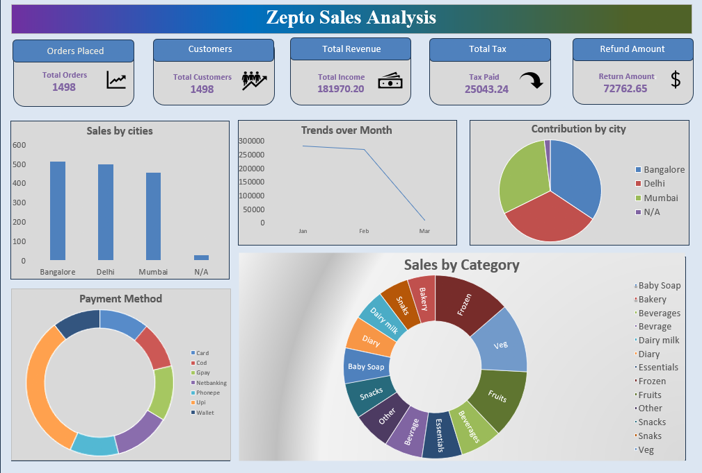

# 📊 Zepto Sales Analysis Dashboard

## 📌 Project Overview

The **Zepto Sales Analysis Dashboard** is an interactive Excel dashboard developed to analyze sales performance and provide meaningful business insights. The dashboard helps stakeholders monitor key performance indicators (KPIs), understand customer purchasing behavior, identify high-performing products, and make data-driven decisions.

The project focuses on analyzing product sales across different **categories**, **customer segments**, **regions**, and **payment methods**, while also identifying **monthly trends**, **seasonal patterns**, and opportunities for business improvement.

---

## 🎯 Objectives

- Analyze sales performance across product categories.
- Compare sales across different regions (cities).
- Study customer purchasing behavior by segment.
- Analyze payment method preferences.
- Identify monthly sales trends and seasonal patterns.
- Track refund amounts and revenue performance.
- Provide actionable business recommendations.

---

## 📂 Dataset

The dataset contains transactional sales information including:

- Order ID
- Order Date
- Customer Details
- Product Name
- Category
- City
- Customer Segment
- Quantity
- Revenue
- Tax
- Payment Method
- Refund Amount

---

## 🛠 Tools Used

- Microsoft Excel
- Pivot Tables
- Pivot Charts
- Slicers
- Conditional Formatting
- Excel Formulas
- Dashboard Design

---

## 📈 Dashboard Features

### KPI Cards

- Total Orders
- Total Customers
- Total Revenue
- Total Tax
- Refund Amount

### Visualizations

- Sales by Cities
- Monthly Sales Trend
- City Contribution
- Payment Method Distribution
- Sales by Category

---

## 📊 Business Questions Answered

- Which product categories generate the highest revenue?
- Which cities contribute the most sales?
- Which payment method is most preferred?
- What are the monthly sales trends?
- Are there seasonal sales patterns?
- Which categories require improvement?
- How much revenue is lost due to refunds?

---

## 📋 Data Cleaning

The dataset was cleaned before analysis by:

- Removing duplicate records
- Handling missing values
- Standardizing text values
- Formatting date columns
- Validating numerical fields
- Creating Pivot Tables for analysis

---

## 💡 Key Insights

- Bangalore and Delhi contribute the highest sales.
- Fruits and Vegetables are among the top-performing categories.
- UPI is the most preferred payment method.
- Sales fluctuate across months, indicating seasonal demand.
- Refund analysis highlights opportunities to improve product quality and delivery services.

---

## 🚀 Business Recommendations

- Increase inventory for high-demand categories.
- Improve sales in low-performing regions.
- Introduce promotional offers for slow-moving products.
- Improve delivery quality to reduce refunds.
- Encourage digital payment adoption.
- Plan inventory based on seasonal demand.

---

## 📷 Dashboard Preview



---

## 📁 Project Structure

```
Zepto-Sales-Analysis/
│
├── Dataset/
│   └── zepto_sales_raw.xlsx
│
├── Documentation/
│   └── Zepto_Sales_Analysis_Report.pdf
│
├── Images/
│   └── dashboard.png
|  
├──  Zepto Sales.xlsx
│
├── README.md
│
└── LICENSE
```

---

## 📌 Future Improvements

- Develop an interactive Power BI dashboard.
- Add Year-over-Year (YoY) and Month-over-Month (MoM) analysis.
- Implement forecasting using machine learning models.
- Integrate real-time sales data.
- Create customer retention and profitability analysis.

---

## 👨‍💻 Author

**Ranjith  A**

Data Analytics Project

---

## ⭐ Acknowledgements

This project was created for learning and academic purposes to demonstrate data cleaning, visualization, dashboard development, and business analysis using Microsoft Excel.
